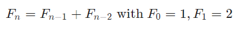
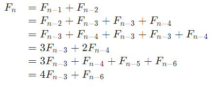
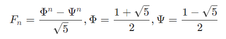
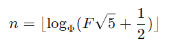
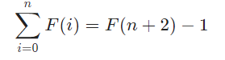

# Solution 2 of Project Euler
## Even Fibonacci numbers

<p align="center">Each new term in the Fibonacci sequence is generated by adding the previous two terms. By starting with 1 and 2, the first 10 terms will be:
<br><br>
1, 2, 3, 5, 8, 13, 21, 34, 55, 89, ...
<br><br>
By considering the terms in the Fibonacci sequence whose values do not exceed four million, find the sum of the even-valued terms.</p>

# Solution

Fibonacci numbers have the following generating rule:

<p align="center"></p><br/>

The naive way to implement the task is looping through all fibonacci numbers this way and adding the values, if they're even:

```javascript
function solution(n) {
  var a = 1, b = 2;
  var s = 0;
  var t;

  while (a <= n) {
    t = a;
    a = b;
    b+= t;
    if (t % 2 == 0)
      s+= t;
  }
  return s;
}
solution(4e6);
```
Or without the branching part:

```javascript
function solution(n) {
  var a = 1, b = 2;
  var s = 0;
  var t;

  while (a <= n) {
    t = a;
    a = b;
    b+= t;
    s+= (-2 | t) + 1 & t; // Or a & -(a & 1 ^ 1)
  }
  return s;
}
solution(4e6);
```
As fibonacci numbers grow quite fast, it takes only 32 iterations to get to the solution. However, the problem can be optimized even more. We could generate only the even numbers as follows:

<p align="center"></p>
And would come to the following implementation:

```javascript
function solution(n) {

  var a = 0, b = 2;
  var t = 2;
  var s = 0;

  while (t <= n) {
    s+= t;
    t = a + 4 * b;
    a = b;
    b = t;
  }
  return s;
}
solution(4e6);
```

Okay, so far so good. But do we even need to loop at all? We have a closed form for fibonacci numbers, using the golden ratio, known as Binet's Formula:
<p align="center"></p>
If we want the reverse, we have a fibonacci number and want to calculate the index nn of that number, the following equation holds:
<p align="center"></p>
As we floor the result, it works for arbitrary numbers and we get the closest fibonacci number below that limit, in our case four million. The last thing we make use of is an identity of the sum of fibonacci numbers, found 

[here](http://www.maths.surrey.ac.uk/hosted-sites/R.Knott/Fibonacci/fibFormulae/) (B&Q 2003-Identity 1):

<p align="center"></p>

Combining these information and dividing the answer by two, since we only want even numbers, we come up with the following solution:

```javascript
var SR5 = Math.sqrt(5);
var PHI = (1 + SR5) / 2;
var PSI = (1 - SR5) / 2;

function F(n) {
  return (Math.pow(PHI, n) - Math.pow(PSI, n)) / SR5;
}

function index(F) {
  return Math.floor(Math.log(F * SR5 + 0.5) / Math.log(PHI));
}

function sum(n) {
  return F(n + 2) - 1;
}

function solution(n) {
  return Math.round(sum(index(n)) / 2);
}
solution(4e6);
```

[The code](https://github.com/Skogrine/ProjectEuler/blob/main/Even%20Fibonacci%20numbers/main.js)
