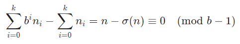

# Solution 20 of Project Euler
## Factorial digit sum

Number reduced by sum of digit is multiple of 9
A known fact in number theory is, that if you take a positive integer and subtract the sum of its digits from that number, you'll end up with a multiple of 9. This can be extended for a general base as well. Let nn be a positive integer in base bb with kk digits, the number then can be represented as:
  

  

That means that 100! - σ(100!) ≡ 0 (mod 9) and since the factorial is a product of numbers, including 3² = 9, factorial of 100 under the modul 9 will become 0. This reduces the search space from [1,1422] to 
 {9p ∈ N|1 ≤ p ≤ 158}. So we have 158 remaining numbers, which could be the final solution. but since i don't have another idea to reduce the result space event further, here the one line brute force solution:

[The code](https://github.com/Skogrine/ProjectEuler/blob/main/Factorial%20digit%20sum/main.py)
