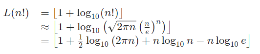

# Solution 20 of Project Euler
## Factorial digit sum

<p align="center">n! means n × (n − 1) × ... × 3 × 2 × 1<br>
For example, 10! = 10 × 9 × ... × 3 × 2 × 1 = 3628800,
and the sum of the digits in the number 10! is 3 + 6 + 2 + 8 + 8 + 0 + 0 = 27.

Find the sum of the digits in the number 100!
</p>

# Solution

The factorial of 100 is a quite big number. By using [Stirling's approximation](https://en.wikipedia.org/wiki/Stirling%27s_approximation) and the calculation of the length of a number, I proved for Problem 25, it's possible to estimate the number of digits we have to deal with:

<p align="center"></p>

Therefore, the length of the number we're looking for is `L(100!)≈158`. The smallest number with 158 digits would be a 1 and 157 zeros, the biggest one would have all nine or a sum of digits of `158×9=1422`, which gives a result search space of `[1,1422]`.

A known fact in number theory is, that if you take a positive integer and subtract the sum of its digits from that number, you'll end up with a multiple of 9. This can be extended for a general base as well. Let nn be a positive integer in base bb with kk digits, the number then can be represented as:

<p align="center"></p>

Since `b ≡ 1 (mod b-1)`, we know that b<sup>m</sup> ≡ 1 (mod b-1), for an arbitrary `m` and therefore

<p align="center"></p>

Subtracting the sum of the digits `σ(n)` from the right side proofs the statement for a general base `b`:

<p align="center"></p>

That means that `100! - σ(100!) ≡ 0 (mod 9)` and since the factorial is a product of numbers, including `3² = 9`, factorial of 100 under the modul 9 will become 0. This reduces the search space from `[1,422]` to `{ 9p ∈ N|1 ≤ p ≤ 158}`. So we have 158 remaining numbers, which could be the final solution. But since I don't have another idea to reduce the result space even further, here the one line brute force solution:

<br><br>

# Python Brute force Solution
```python
import math
n = 100
print(sum(map(int, str(math.factorial(n)))))
```

[The code](https://github.com/Skogrine/ProjectEuler/blob/main/Factorial%20digit%20sum/main.py)
