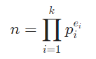
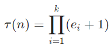

# Solution 12 of Project Euler
## Highly divisible triangular number

<p align="center">
The sequence of triangle numbers is generated by adding the natural numbers. So the 7th triangle number would be 1 + 2 + 3 + 4 + 5 + 6 + 7 = 28. The first ten terms would be:
<br><br>
1, 3, 6, 10, 15, 21, 28, 36, 45, 55, ...
<br><br>
Let us list the factors of the first seven triangle numbers:
<blockquote>
<strong>&nbsp;1</strong>: 1<br>
<strong>&nbsp;3</strong>: 1,3<br>
<strong>&nbsp;6</strong>: 1,2,3,6<br>
<strong>10</strong>: 1,2,5,10<br>
<strong>15</strong>: 1,3,5,15<br>
<strong>21</strong>: 1,3,7,21<br>
<strong>28</strong>: 1,2,4,7,14,28
</blockquote><br>
We can see that 28 is the first triangle number to have over five divisors.
What is the value of the first triangle number to have over five hundred divisors?
</p>

# Solution

The number of divisors of a natural number nn is given by `tau(n)` or `τ(n)` or sometimes `δ(n)` as mentioned [here](https://www.xarg.org/2016/06/calculate-the-sum-of-divisors/) already. Every natural number can be expressed as the product of their `k` prime factors like this:

<p align="center"><p>

Then the number of divisors is given by

<p align="center"><p>

So we need a prime factorization and simply need a product with their exponents. By modifying the factorize function from Problem 3 can, we can calculate the product easily:

```javascript
function tau(num) {

    var n = num;
    var i = 2;
    var p = 1;

    if (num === 1) return 1;

    while (i * i <= n) {
        var c = 1;
        while (n % i === 0) {
            n/= i;
            c++;
        }
        i++;
        p*= c;
    }

    if (n === num || n > 1)
        p*= 1 + 1;

    return p;
}
```
With this function, we can formulate the final solution:
```javascript
function solution(x) {

    var n = 1;
    var d = 1;

    while (tau(d) <= x) {
        n++;
        d+= n;
    }
    return d;
}
solution(500);
```

One improvement could be to prepare an array of primes to loop over, to not linearly scan for primes.

[The code](https://github.com/Skogrine/ProjectEuler/blob/main/Highly%20divisible%20triangular%20number/main.js)
