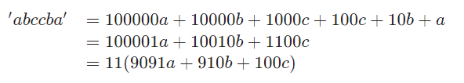

# Solution 4 of Project Euler
## Largest palindrome product

<p align="center">
A palindromic number reads the same both ways. The largest palindrome made from the product of two 2-digit numbers is 9009 = 91 × 99.<br><br>Find the largest palindrome made from the product of two 3-digit numbers.</p>

# Solution

First observation is that the number must be between 100² and 999² or in the range of [10000, 998001]. As the majority of numbers has 6 digits and we're looking for the largest, we ignore 5 digits numbers. Based on this, we can construct a palindromic number as:

<p align="center"></p><br/><br />

As such, we're looking for two lagest numbers `p, q ∈ {x|100 ≤ x ≤ 999} ⊂ N` with:<br>
`p ⋅ q = 11(9091a + 910b + 100c) ≤ 999²`
<br /><br />

This equation shows us, that either `p` or `q`, but not both must have a factor of 11. In order to maximize the two unknown, we start searching with `p=999` and for each decreasing `p`, we search a maximum `q` to construct a palindrome. We can make an optmization based on the observation before: If `p` is not divisible by 11, `q` must be, and as such we can start searching with 990 as the largest multiple of 11 and search only for multiples of 11. Another optimization is, that we don't need to let `q` go below `p` since we can interchange the numbers. An implementation can then look as follows:

```javascript
function solution() {

    var r = 0;

    for (var s, q, p = 999; p >= 100; p--) {

        if (p % 11 === 0) {
            q = 999;
            s = 1;
        } else {
            q = 990;
            s = 11;
        }

        for (; q > 99; q-= s) {

            var t = p * q;

            if (r < t && isPalindrome(t)) {
                r = t;
                break;
            }
        }
    }
    return r;
}
```

Okay that's good. But why not reversing `p, q` again. We could loop `p` from 990 through the multiples 11 and use `q` to match a palindrome. Adding another condition to break the inner loop early reduces the search space about 42 times.

```javascript
function solution() {

  var r = 0;

  for (var p = 990; p > 99; p-= 11) {

    for (var q = 999; q > 99; q--) {

      var t = p * q;

      if (r < t && isPalindrome(t)) {
        r = t;
        break;
      } else if (t < r) {
        break;
      }
    }
  }
  return r;
}
```

For the hackerrank implementation, a parameter `N` is needed, wich limits the maximum number. This simply changes the central condition to `r < t < N ∧ isPalindrome(t)`. Furthermore, the solution utilizes a simple helper function to check if a number actually is a palindrome:

```javascript
function isPalindrome(x) {

    var n = 0;
    var m = x;

    while (x > 0) {
        n = n * 10 + x % 10;
        x = x / 10 | 0;
    }
    return n === m;
}
```

[The code](https://github.com/Skogrine/ProjectEuler/blob/main/Largest%20palindrome%20product/main.js)
