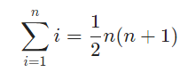
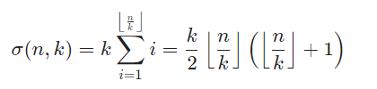

# Solution 1 of Project Euler
## Multiples of 3 and 5

<p align="center">If we list all the natural numbers below 10 that are multiples of 3 or 5, we get 3, 5, 6 and 9. The sum of these multiples is 23.
<br><br>
Find the sum of all the multiples of 3 or 5 below 1000.
<br><br></p>

# Solution

The sum of the multiples of 3 or 5 can be calculated quite simple by looping from 1 to 999 and check what numbers are divisible by 3 and 5:

```javascript
function solution(n) {
  var c = 0;
  for (var i=1; i < n; i++) {
    if (0 === i % 3 || 0 === i % 5)
      c+= i;
  }
  return c;
}
```
Scanning through a small range like this is no problem for a computer. But a linear complexity for this problem isn't satisfying. Carl Friedrich Gauß re-discovered the famous formula as a child, which is known as the Gauss summation formula:

<p align="center"></p><br/><br />

We can use this formulation to get to know what the sum of all multiples of 3 or 5 is. All multiples of 3 for example are `3, 6, 9, 12,...` If we place 3 outside the brackets, it reads `3 ⋅ (1,2,3,4,...)`. And how many numbers do we need to sum? Of course `⌊3/n⌋`. When we say, we grant to find it for a general `k` instead of 3, and calculate the sum of the multiples, we arive at:

<p align="center"></p><br/><br />

If we now sum `σ(999,3) + σ(999,5)`, we have one problem: all numbers which are divisible by 3 and 5 are counted twice. As the `lcm(5,3) = 15`, we have to subtract all multiples of 15, so we finally get:
`σ(999,3) + σ(999,5) - σ(999,15)`. Implementating it in JavaScript can then look like this:

```javascript
function solution(n) {

   var r = Math.floor(n / 3);
   var s = Math.floor(n / 5);
   var t = Math.floor(n / 15);

   return 0.5 * (
         3 * r * (r + 1)
      +  5 * s * (s + 1)
      - 15 * t * (t + 1));
}
```

Or minimized/obfuscated a bit more:

```javascript
function solution(n) {

   var r = n / 3 | 0;
   var s = n / 5 | 0;
   var t = n / 15 | 0;

   return 3 * r * ++r + 5 * s * ++s - 15 * t * ++t >> 1;
}
solution(999);
```

[The code](https://github.com/Skogrine/ProjectEuler/blob/main/Multiples%20of%203%20or%205/main.js)
