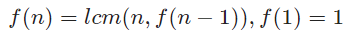
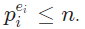

# Solution 5 of Project Euler
## Smallest multiple

<p align="center">
2520 is the smallest number that can be divided by each of the numbers from 1 to 10 without any remainder.<br /><br />What is the smallest positive number that is evenly divisible by all of the numbers from 1 to 20?</p>

# Solution

The first thing that comes into mind is to calculate the recursive lcmlcm of the numbers from one to twenty:

<p align="center"></p>

As the lcm is usually defined by the gcd, which is bound to somewhat `O(log(min(a,b)))`, we arrive at approximately `O(nlog(n))`. The resulting algorithm can be stated as
```javascript
gcd = (a, b) => b == 0 ? a : gcd(b, a % b);
lcm = (a, b) => a * b / gcd(a, b);
solution = n => n == 1 ? 1 : lcm(n, f(n - 1));
```

The first improvement is to get rid of the recursive definition:

```javascript
function solution(num) {

    var n = 1;
    for (var i = 1; i <= num; i++) {
        n = lcm(n, i);
    }
    return n;
}
```
When we analyze the primes, we'll see that it's not necessary to start with index 1, since the primes will occur in higher indexes as well, it turns out that we can skip 10 indexes and start with 11:

```javascript
function solution(num) {

    var n = 1;
    for (var i = 11; i <= num; i++) {
        n = lcm(n, i);
    }
    return n;
}
```
But that's still not the best thing we can do. Theoretically, we must find the primes `p`, such that all the numbers from one to twenty can be constructed from it. By analyzing the things we got:

```javascript
2¹ ⋅ 3¹ ⋅ 2² ⋅ 5¹ ⋅ 2¹3¹ ⋅ 7¹ ⋅ 2³ ⋅ 3² ⋅ 2¹5¹ = 2³ ⋅ 3² ⋅ 5¹ ⋅ 7¹
```

That is, we factorize every factor and remember the maximum exponent for each prime factor:
```javascript
function solution(n) {
   var h = {};
   for (var i = 1; i <= n; i++) {
      var e = factorize(i);
      for (var j in e) {
         if (h[j])
            h[j] = Math.max(h[j], e[j]);
         else h[j] = e[j];
      }
   }
   var res = 1;
   for (var i in h)
      res*= Math.pow(i, h[i]);
   return res;
}
```

That's better, but we now have to use a quite complex function to find the prime factorization of every factor. But what does the maximum exponent mean? It's the largest natural number such that .
Solving this equation for `eᵢ` yields `eᵢ = ⌊log n/log pᵢ⌋`. When looping over all primes which are less or equal to our actual number, we can find the solution with:

```javascript
function solution(n) {

   // Add more primes...
   var p = [2, 3, 5, 7, 11, 13, 17, 19, 23, 29];

   var res = 1;
   for (var i = 0; p[i] <= n; i++) {
      res*= Math.pow(p[i], Math.floor(Math.log(n) / Math.log(p[i])));
   }
   return res;
}
```
One important thing to notice is that we don't need to run the calculation on all primes. When the exponent becomes too large, namely if we would need a higher exponent than 1, it still makes sense. For all other numbers, we simply need to multiply the factor itself. That means, our loop needs to be run to `sqrt(n)` only:

```javascript
function solution(n) {

   // Add more primes...
   var p = [2, 3, 5, 7, 11, 13, 17, 19, 23, 29];

   var sqrt_n = Math.sqrt(n), log_n = Math.log(n);
   var res = 1;
   for (var i = 0; p[i] <= sqrt_n; i++) {
        res*= Math.pow(p[i], Math.floor(log_n / Math.log(p[i])));
   }

   for (; p[i] <= n; i++) {
      res*= p[i];
   }
   return res;
}
```

[The code](https://github.com/Skogrine/ProjectEuler/blob/main/Smallest%20multiple/main.js)
