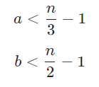
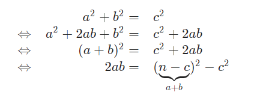
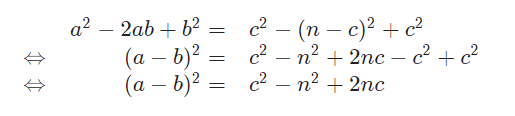

# Solution 9 of Project Euler
## Special Pythagorean triplet

<p align="center">
A Pythagorean triplet is a set of three natural numbers, a < b < c, for which,
<br>
a<sup>2</sup> + b<sup>2</sup> = c<sup>2</sup>
<br>
For example, 3<sup>2</sup> + 4<sup>2</sup> = 9 + 16 = 25 = 5<sup>2</sup>.
<br>
There exists exactly one Pythagorean triplet for which a + b + c = 1000.
Find the product abc.
</p>

# Solution

A problem like this is perfect for Haskell, since we can transform the mathematical description par for par into a programm:

```javascript
solution n = head [a * b * c |
    c <- [1..n],
    b <- [1..c],
    a <- [1..b],
    a^2 + b^2 == c^2,
    a + b + c == n]
```

However, it takes quite some time to find the solution with this brute force attempt. One improvement is to use the fact that `a+b+c=n` which let us construct the variable `c=n-a-b` (we could construct c as `c=√a²+b²`, but this is computational much more expensive and of course we could construct a and b but this would require another check if the result becomes negative). This minimal change reduces the execution time tremendously, since we reduced the algorithm from `O(n³)` to `O(n²)`:

```javascript
solution n = head [a * b * c |
  b <- [1..n],
  a <- [1..b],
  let c = n - a - b,
  a^2 + b^2 == c^2]
```

In order to mind the given relation `a < b < c`, we would need to add a check of `b < c`, but as `a² + b² = c² ⇒ b < c` for `a > 0`, we can skip this test. But based on the fact that `a < b < c` and `a + b + c = n`, we can conclude even more: The maximum possible aa and maximum possible `b` is:

<p align="center"></p>

Since `a` as this smallest number plus the sum of two other numbers shall not exceed `n`. The same takes effect for `b` as this smallest number plus `c` shall not exceed `n`. With this information, we can further reduce the search space:

```javascript
solution n = head [a * b * c |
  a <- [1..quot n 3],
  b <- [a..quot n 2],
  let c = n - a - b,
  a^2 + b^2 == c^2]
```

We learned quite a lot already, but the search space is still too large, so back to the drawing board. We know `a + b = n - c` and `a² + b² = c²`, which lets us formulate

<p align="center"></p>

When subtracting the resulting equations from the starting equation, we get

<p align="center"></p>

Since `(a-b)² = c² - n² + 2nc`, we know the right part must be square. We achieved, that we completely removed a and b! As we constructed the triplet this way, we find a solution if the integer square root exists. Implementing all this knowledge leads to a solution which only depends on `c` and calculates in linear time `O(n)`:

```javascript
solution n = head [ a * b * c |
  c <- [1 + quot n 3 .. quot n 2],
  let sqa_b = c * c - n * n + 2 * n * c,
  let a_b = floor(sqrt(fromIntegral sqa_b)),
  let b = quot (n - c + a_b) 2,
  let a = n - b - c,
  a_b * a_b == sqa_b]
```

Or the same implemented in JavaScript or Python:

```javascript
function solution(n) {

  for (var c = Math.floor(n / 3 + 1); c < n / 2; c++) {

    var sqa_b = c * c - n * n + 2 * n * c
    var a_b = Math.floor(Math.sqrt(sqa_b));

    if (a_b * a_b == sqa_b) {
      var b = (n - c + a_b) / 2;
      var a = n - b - c;
      return a * b * c;
    }
  }
  return -1
}
solution(1000);
```

```python
c = 335
b = 334
a = 1000 - c - b
while a + b + c != 1000 or a**2 + b**2 != c**2:
    if a > b or b == 2:
        c += 1
        b = c - 1
    b -= 1
    a = 1000 - c - b
print(a*b*c)
```

[The code](https://github.com/Skogrine/ProjectEuler/blob/main/Special%20Pythagorean%20triplet/main.py)
