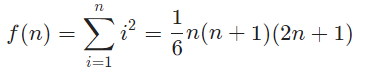
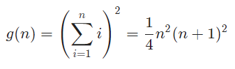
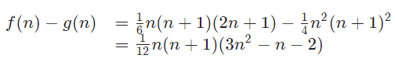

# Solution 6 of Project Euler
## Sum square difference

<p align="center">
The sum of the squares of the first ten natural numbers is,
<br>
12 + 22 + ... + 102 = 385
<br>
The square of the sum of the first ten natural numbers is,
<br>
(1 + 2 + ... + 10)2 = 552 = 3025
<br>
Hence the difference between the sum of the squares of the first ten natural numbers and the square of the sum is 3025 − 385 = 2640.
<br>
Find the difference between the sum of the squares of the first one hundred natural numbers and the square of the sum
</p>

# Solution

The sum of the square is:
<p align="center"></p>
The square of the sum is:
<p align="center"></p>
The difference:
<p align="center"></p>
<br /><br/>

And the final JS solution:
```javascript
function solution(n) {
    return n * (n + 1) * (3 * n * n - n - 2) / 12;
}
```

Or in Python
```python
sum_square = square_sum = 0
for i in range(1, 101):
    sum_square += 1**2
    square_sum += i

square_sum = square_sum ** 2
resultat = square_sum ** 2 - sum_square
print("Résultat")
print(resultat)
```

[The code](https://github.com/Skogrine/ProjectEuler/blob/main/Sum%20square%20difference/main.py)
