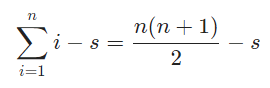

# Solution 10 of Project Euler
## Summation of primes

<p align="center">
The sum of the primes below 10 is 2 + 3 + 5 + 7 = 17.
<br>
Find the sum of all the primes below two million.
</p>

# Solution

This problem is a good example for a sieve approach. A function I use quite often from my library is the following Sieve of Eratosthenes. The implementation is straightforward, but it gives the inverse. All primes are marked with 0! The reason is, we can construct the array with Uint8Array, so we save memory and it's initialized with 0 already, which saves the initial fill operation.

```javascript
function sieve(n) {

  var data = new Uint8Array(n + 1);
  data[0] = 1;
  data[1] = 1;
  var bound = Math.floor(Math.sqrt(n));
  for (var i = 2; i <= bound; i++) {

    if (data[i] === 0) {
      for (var j = i + i; j <= n; j+= i) {
        data[j] = 1;
      }
    }
  }
  return data;
}
```

We can optimize the sieve a bit, even if we don't take these optimizations into account for further progress of the solution. We can handle all even numbers separately and as a result, we can process all odd numbers with steps of two. Another nice benefit of having processed all even numbers is that we can skip all even multiples of a certain number as well, which allows us to iterate the inner loop at `2ⁱ` instead of `i`. Another optimization is that all multiples of `i` below `i²` have already been processed by smaller multiples, so we can start each inner loop with `i²`. The optimized code, which is about 40% faster looks like this:

```javascript
function sieve(n) {

  var data = new Uint8Array(n + 1);
  data[0] = 1;
  data[1] = 1;
  var bound = Math.floor(Math.sqrt(n));

  for (var i = 4; i <= n; i+= 2) {
    data[i] = 1;
  }

  for (var i = 3; i <= bound; i+= 2) {

    if (data[i] === 0) {
      for (var j = i * i; j <= n; j+= i + i) {
        data[j] = 1;
      }
    }
  }
  return data;
}
```

In order to complete the task we could loop again over the array and sum all non-primes. The result would then be the sum of all numbers minus the sum of all non-primes:

<p align="center"></p>

As we already know what primes are, we can use the function above as a template to save these extra roundtrips, by calculating it inline:

```javascript
function solution(n) {

  var sum = 1;
  var data = new Uint8Array(n + 1);
  data[0] = 1;
  data[1] = 1;
  var bound = Math.floor(Math.sqrt(n));
  for (var i = 2; i <= bound; i++) {

    if (data[i] === 0) {
      for (var j = i + i; j <= n; j+= i) {
        if (data[j] === 0) {
          data[j] = 1;
          sum+= j;
        }
      }
    }
  }
  return n * (n + 1) / 2 - sum;
}
```
There are still couple improvements we can make: We don't need to remember all even numbers all the time and as we need the sum, we can work into that direction as well to save some iterations:
```javascript
function solution(n) {

  var sum = 0;
  var bound = (Math.sqrt(n + 1) - 1) >> 1;
  n = n >> 1;

  var data = new Uint8Array(n + 1);

  for (var i = 1; i <= bound; i++) {

    for (var j = i * 2 * (i + 1); j <= n; j+= 2 * i + 1) {

      if (data[j] === 0) {
        data[j] = 1;
        sum+= j * 2 + 1;
      }
    }
  }
  return 2 + n * (n + 1) + n - sum;
}
solution(2e6 - 1);
```

[The code](https://github.com/Skogrine/ProjectEuler/blob/main/Summation%20of%20primes/main.js)
